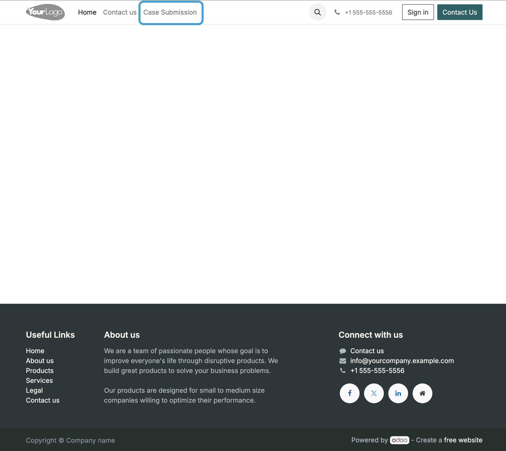
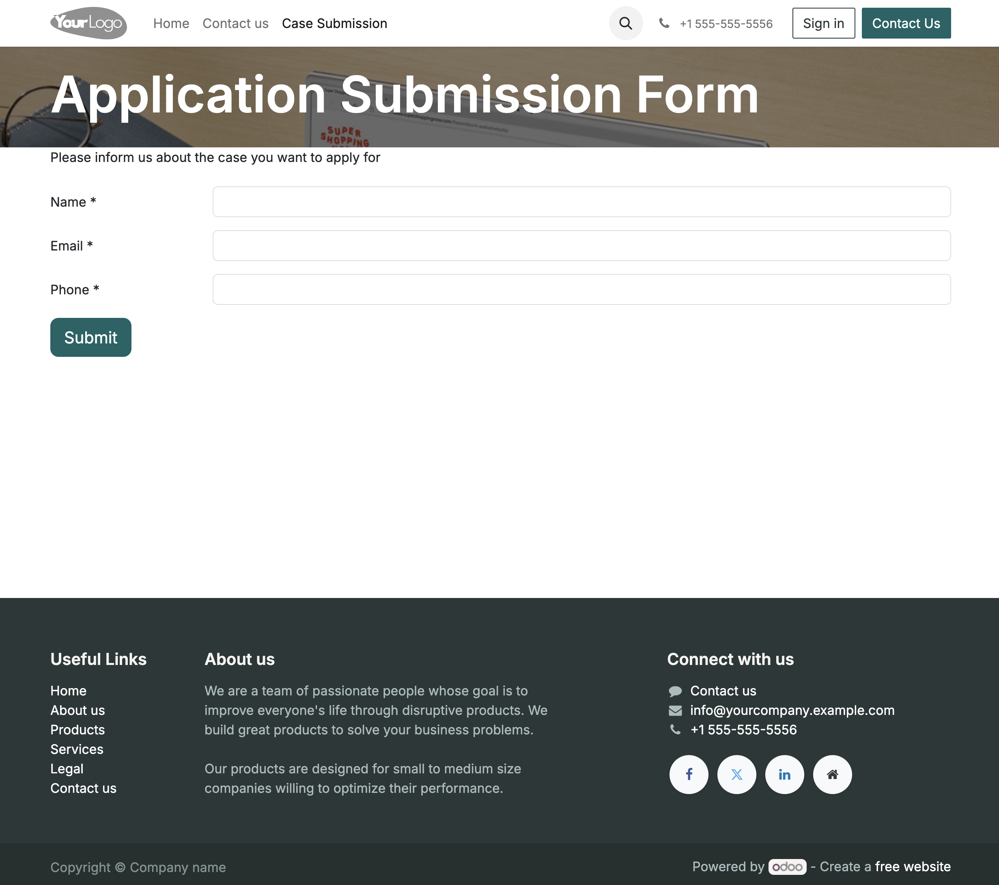
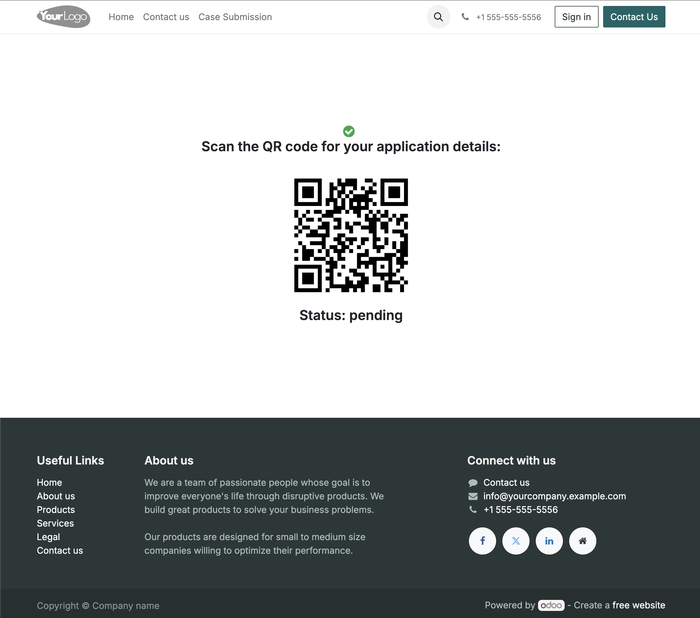
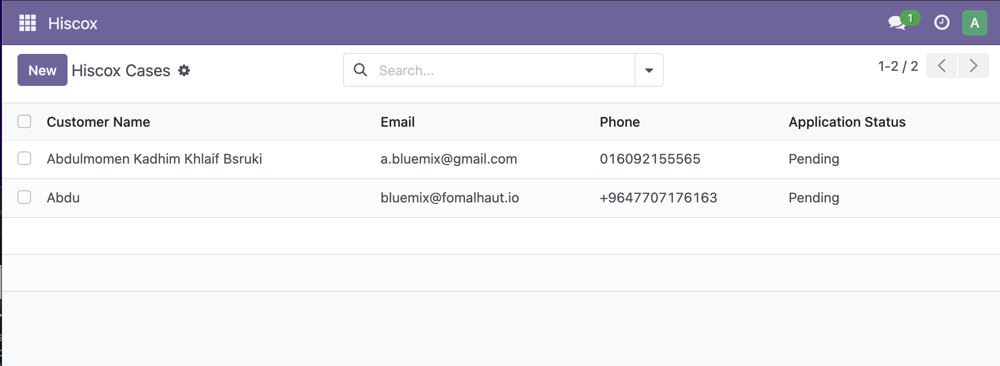

# Hiscox Odoo Module

This Odoo 17 module allows users to submit and track Hiscox insurance applications through a website form.


### User Documentation

How to use this module is shown in the following screenshots. After installing `hiscox` module:

1) The customer navigates to Case Submission



2) The customer fills out the required details, as shown in the form



3) A QR code is generated when the form is submitted successfully



### Backoffice

Simpley, you'll see Hiscox menu item, and when clicked, you'll have a list of all submitted application cases




## Installation & Running via Docker
### Steps
1. Clone the repository:
   ```bash
   git clone https://github.com/your-repo/odoo_hiscox.git
   cd odoo_hiscox
   ```
2. Build and run the Docker containers:
   ```bash
   docker compose -f docker/docker-compose.yml up --build -d
   ```
3. Access Odoo at:
   - **Odoo Web Interface**: [http://localhost:8069](http://localhost:8069)


### Stopping the Containers
```bash
docker-compose down
```

